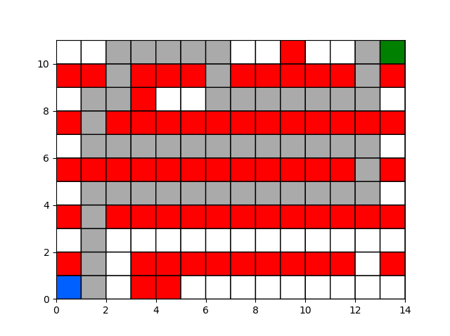

# Pathfinding Algorithms

This is a repository for path finding algorithms.


## Files in this repository:

### A* with heap - Python
This is an impelmentation of A* with a binary heap in Python.
Note that this version uses a modified cost function

The following image shows an example result with the following colour code:
- White: walkable
- Red: obstacle (not walkable)
- Blue: starting position
- Green: goal position
- Grey: path found



Note that in this version on each iteration it is only allowed to go Up, Down, Left or Right. To allow diagonal checks change the following line of code:
```
neighbours = [(0,1),(0,-1),(1,0),(-1,0)]
```
to:
```
neighbours = [(0,1),(0,-1),(1,0),(-1,0),(1,1),(1,-1),(-1,1),(-1,-1)]
```


### Backtracking maze solver - C++
(backtracking_maze.cpp)

Implementation of a backtracking algorithm to find a path from a given starting point
to a goal position in a maze.

The maze will look like (for example):

	1 1 0 1 
	1 0 1 0 
	1 1 1 0 
	0 0 1 1

where 1's are walkable and 0's are walls.

In this implementation the mouse is only allowed to go down and right.

The solution found would be:

	1 0 0 0 
	1 0 0 0 
	1 1 1 0 
	0 0 1 1 

where 1's represent the path.


### Dijkstra's Shortest Path Algorithm - C++
(dijsktra1.cpp)

This is a greedy algorithm that will find the shortets path from every node in a graph to a source node.
The algorithms takes the source node and a matrix which holds the weight between each node:

	  0, 4, 0, 0, 0, 0, 0, 8, 0
      4, 0, 8, 0, 0, 0, 0, 9, 0
      0, 8, 0, 7, 0, 4, 0, 0, 2
      0, 0, 7, 0, 9, 14, 0, 0, 0
      0, 0, 0, 9, 0, 10, 0, 0, 0
      0, 0, 4, 14, 10, 0, 2, 0, 0
      0, 0, 0, 0, 0, 2, 0, 1, 6
      8, 9, 0, 0, 0, 0, 1, 0, 7
      0, 0, 2, 0, 0, 0, 6, 7, 0

and outputs the shortest distance of each node to the given source:
```
	A                0
	B                4
	C                12
	D                19
	E                21
	F                11
	G                9
	H                8
	I                14
```